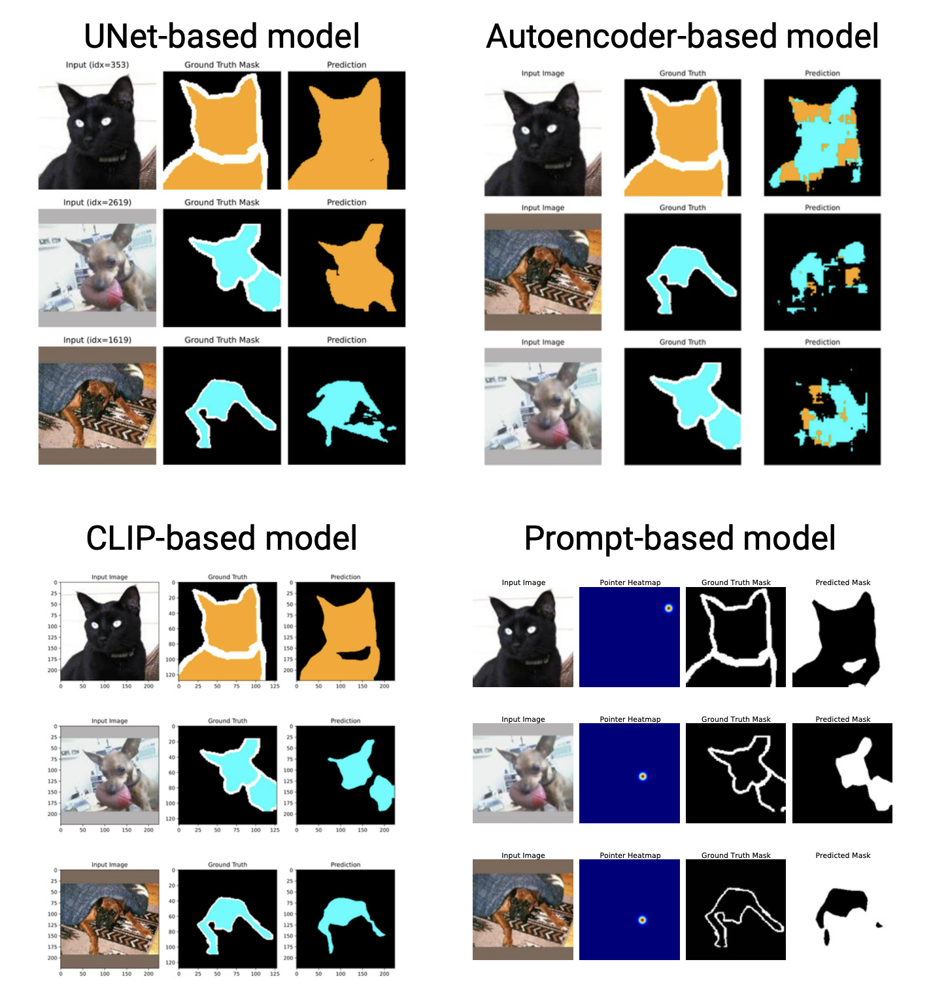

# 🧠 Comparative Study of Segmentation Models on the Oxford-IIIT Pet Dataset

This project presents a comprehensive evaluation of four segmentation architectures — **UNet**, **Autoencoder**, **CLIP-based**, and **Prompt-guided** — using the standardized [Oxford-IIIT Pet Dataset](https://www.robots.ox.ac.uk/~vgg/data/pets/). The aim is to explore architectural trade-offs, robustness to perturbations, and practical applicability in real-world computer vision tasks.

## 📄 Project Report

A detailed write-up of the experiments and findings is available in this paper:  
🔗 [Read the full report on Google Drive](https://drive.google.com/file/d/1WktaY_pguMPYaYiN5j8CaSV3rMvuNl-F/view?usp=sharing)

## 🔍 Summary of Findings

- **UNet** shows strong generalization and clear boundary segmentation but underperforms in crowded or imbalanced class conditions.
- **Autoencoder**, due to its two-step decoding and limited semantic expressiveness, struggles with convergence and shows inconsistent behavior during training.
- **CLIP-based segmentation**, leveraging frozen multimodal embeddings, outperforms other models on all major metrics and is highly robust to both structural and photometric noise.
- **Prompt-guided segmentation** reaches high pixel accuracy with added user input, making it ideal for interactive or semi-automated annotation tasks, despite slightly lower spatial precision.

## 📌 Key Insights

- Pretraining and multimodal fusion significantly enhance segmentation performance and robustness.
- Simpler models like UNet can still provide efficient, lightweight solutions for deployment-focused scenarios.
- Prompt-based models balance accuracy and interactivity, opening new directions for user-in-the-loop vision systems.
